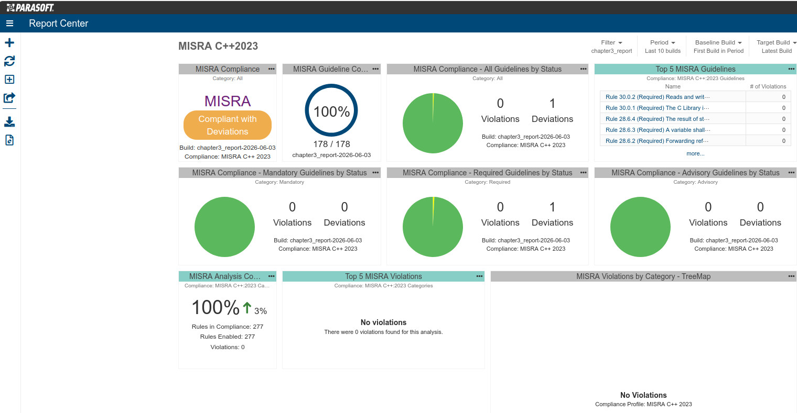

# Chapter 3: stack overflow in flood-fill

(TODO: Add chapter 3 introduction)

Toolchain setup, build, test, lint, and sanitizer instructions are in
the [repository README](../README.md). To build and test only this
chapter:

```bash
bazel build //chapter3/...
bazel test //chapter3/...
```

## Layout

```
chapter3/
├── include/             Public headers
├── src/                 Library implementations
│   └── flood_fill/      Recursive and iterative variants
├── demos/               Runnable binaries (original, instrumented, solutions)
└── test/                Unit tests
```

## Listings and their targets

| Listing | Description                                             | Where it lives in the repo                                          |
| ------- | ------------------------------------------------------- | ------------------------------------------------------------------- |
| 3.1     | Recursive flood-fill (original)                         | `chapter3/src/flood_fill/recursive.cpp`                           |
| 3.2     | Instrumented version for crash observation              | `chapter3/src/flood_fill/internal/recursive_instrumented.{h,cpp}` |
| 3.3     | `SIGSEGV` handler with stack-overflow trigger         | Not in this repo (illustrative; see §3.4.5 of the book)            |
| 3.4     | Depth-bounded recursive flood-fill                      | `chapter3/src/flood_fill/bounded.cpp`                             |
| 3.5     | Iterative DFS, function-local worklist                  | `chapter3/src/flood_fill/iterative_dfs.cpp`                       |
| 3.6     | `floodFillIterativeDFS` with a caller-supplied buffer | `chapter3/src/flood_fill/iterative_dfs_buffered.cpp`              |
| 3.7     | Iterative BFS, function-local queue                     | `chapter3/src/flood_fill/iterative_bfs.cpp`                       |

The shared `WorklistBuffer` aggregate used by Listing 3.6 (and its BFS
counterpart) lives at `chapter3/include/worklist_buffer.h`.

Demo binaries:

| Run                                         | What it does                                                                                                                                                                                                                                |
| ------------------------------------------- | ------------------------------------------------------------------------------------------------------------------------------------------------------------------------------------------------------------------------------------------- |
| `bazel run //chapter3/demos:original`     | The bare recursive flood-fill on two grids. The 50x50 grid finishes; the 500x500 grid crashes with SIGSEGV. The crash is the chapter's argument, not a defect.                                                                              |
| `bazel run //chapter3/demos:instrumented` | Same recursive algorithm with a depth observer that prints the maximum recursion depth reached and writes stderr breadcrumbs as the depth grows. The 500x500 grid still crashes; the depth output shows how far it got before being killed. |
| `bazel run //chapter3/demos:solutions`    | All five Part II variants (Listings 3.4, 3.5, 3.6, 3.7, plus the BFS buffered companion) on the same 500x500 fully occupied grid that crashes the recursive version. The four iterative variants label all 250,000 cells; Solution 1 stops at `kDepthLimitExceeded` after 65, which is the point of the depth bound. |

## MISRA C++ 2023 compliance

Latest static-analysis results for chapter 3, scanned with Parasoft
C/C++test 2025.2.0 against the MISRA C++ 2023 rule set and reported by
Parasoft DTP.



Chapter 3 is MISRA C++ 2023 compliant with 1 deviation. See
[DEVIATIONS.md](../DEVIATIONS.md) for the deviation register and its
justification.

## Stack usage and assembly (optional)

Chapter 3 cites per-call frame sizes (48 bytes at `-O2`, 64 bytes at
`-O0` for `ch3::floodFill`). The numbers below were verified on GCC 14
through the Bazel toolchain used by CI.

### Bazel

`--spawn_strategy=local` is required: under the default sandbox, the
`.su` and `.s` side-output files are discarded as undeclared outputs.

```bash
# Per-call frame size at -O2
bazel build //chapter3/src:flood_fill_recursive \
  --compilation_mode=opt \
  --copt=-fstack-usage \
  --spawn_strategy=local

cat bazel-out/k8-opt/bin/chapter3/src/_objs/flood_fill_recursive/recursive.su
```

For `-O0`, swap the mode and add an explicit `-O0`:

```bash
bazel build //chapter3/src:flood_fill_recursive \
  --compilation_mode=dbg \
  --copt=-fstack-usage --copt=-O0 \
  --spawn_strategy=local

cat bazel-out/k8-dbg/bin/chapter3/src/_objs/flood_fill_recursive/recursive.pic.su
```

For the assembly prologue, use `-save-temps`. Bare `-S` breaks Bazel
because no `.o` is produced and the rule fails.

```bash
bazel build //chapter3/src:flood_fill_recursive \
  --compilation_mode=opt \
  --copt=-save-temps \
  --spawn_strategy=local

find -L bazel-out -name 'recursive*.s' -path '*flood_fill_recursive*'
```

### Plain g++

```bash
g++ -std=c++17 -O2 -fstack-usage \
  -I chapter3/include -I chapter3/src \
  -c chapter3/src/flood_fill/recursive.cpp \
  -o /tmp/recursive.o
grep floodFill /tmp/recursive.su
```

The `.su` file is named after the `-o` target, so use distinct `-o`
names if you want `-O2` and `-O0` results side by side.

Frame sizes can shift across compiler versions and target ABIs. If your
machine reports different numbers, read the assembly prologue to see
where the bytes come from rather than treating the difference as a
build error.

### Iterative solutions (Figure 3.12)

Figure 3.12 contrasts the recursive call chain (one frame per cell) with
the iterative variants (a single frame). What the `.su` reports for an
iterative variant depends on where its worklist lives:

- **Function-local worklist** (`flood_fill_iterative_dfs`,
  `flood_fill_iterative_bfs`): the `std::array<Coordinate, kMaxCells>`
  sits inside the frame, so the `.su` reports tens of KB (20,128 B on
  GCC 14 at -O2 here), not a few hundred. This is the variant to keep off
  a small stack.
- **Caller-supplied buffer** (`flood_fill_iterative_dfs_buffered`,
  `flood_fill_iterative_bfs_buffered`): the worklist lives in a
  `WorklistBuffer` the caller owns (put that object at file scope and it
  lands in `.bss`, off the stack entirely), so the frame holds only loop
  scalars. This is the small fixed frame Figure 3.12 illustrates: 112 B
  on GCC 14 at -O2 here, versus the 144 B drawn in the figure. The count
  shifts with compiler and ABI (see the caveat above); the point is that
  it is a small constant, independent of grid size.

```bash
# Small fixed frame: worklist is caller-supplied, so it is not in the frame
bazel build //chapter3/src:flood_fill_iterative_dfs_buffered \
  --compilation_mode=opt \
  --copt=-fstack-usage \
  --spawn_strategy=local

cat bazel-out/k8-opt/bin/chapter3/src/_objs/flood_fill_iterative_dfs_buffered/iterative_dfs_buffered.su
```

Swap `dfs` for `bfs` for the BFS variant. To see the contrasting large
frame, build the function-local target instead:

```bash
bazel build //chapter3/src:flood_fill_iterative_dfs \
  --compilation_mode=opt \
  --copt=-fstack-usage \
  --spawn_strategy=local

cat bazel-out/k8-opt/bin/chapter3/src/_objs/flood_fill_iterative_dfs/iterative_dfs.su
```

Plain g++ for the caller-supplied frame (`worklist_buffer.h` is under
`chapter3/include`, so the same `-I` flags resolve it):

```bash
g++ -std=c++17 -O2 -fstack-usage \
  -I chapter3/include -I chapter3/src \
  -c chapter3/src/flood_fill/iterative_dfs_buffered.cpp \
  -o /tmp/iterative_dfs_buffered.o
grep -i floodfill /tmp/iterative_dfs_buffered.su
```
